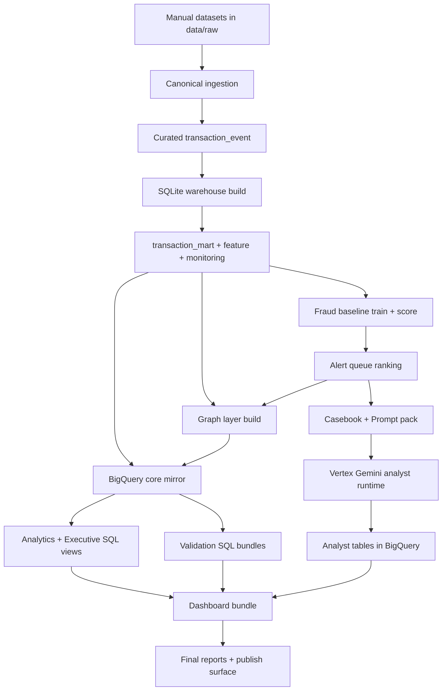

# Fraud - AML Graph Sentinel

Turkish version (TR): [README.tr.md](README.tr.md)

An end-to-end fraud and anti-money-laundering (AML) intelligence project that unifies:

- multi-source transaction ingestion,
- deterministic feature/warehouse modeling,
- probabilistic fraud scoring,
- queue prioritization,
- graph intelligence,
- BigQuery semantic analytics,
- Vertex AI Gemini analyst copilot,
- and a publish-ready executive dashboard.

As of the **latest checkpoint snapshot timestamp**, all core quality gates passed and the project is in a **READY FOR PUBLISH** state.
State is derived from checkpoint and dashboard validator artifacts:
`reports/03_Operational_Checkpoint_Snapshot.json` and `dashboard/dashboard-data.json`.

## Table of Contents

- [1. Project Name, Topic, Scope](#1-project-name-topic-scope)
- [2. Purpose, Objectives, and Targets](#2-purpose-objectives-and-targets)
- [3. Business Questions and Problems Solved](#3-business-questions-and-problems-solved)
- [4. End-to-End Architecture and Workflow](#4-end-to-end-architecture-and-workflow)
- [5. Data Sources](#5-data-sources)
- [6. Methodology (From Raw Data to Decision Layer)](#6-methodology-from-raw-data-to-decision-layer)
- [7. Agents, Models, and Their Functions](#7-agents-models-and-their-functions)
- [8. Statistical and Analytical Methods](#8-statistical-and-analytical-methods)
- [9. Technology Stack and Tools](#9-technology-stack-and-tools)
- [10. Repository Structure](#10-repository-structure)
- [11. Pipeline Stages and Commands](#11-pipeline-stages-and-commands)
- [12. Validation, Testing, and Quality Gates](#12-validation-testing-and-quality-gates)
- [13. Current Results Snapshot](#13-current-results-snapshot)
- [14. Dashboard and How to Open It](#14-dashboard-and-how-to-open-it)
- [15. Security, Secrets, and Safe Open-Source Push](#15-security-secrets-and-safe-open-source-push)
- [16. What Was Achieved, and What Can Be Extended Next](#16-what-was-achieved-and-what-can-be-extended-next)
- [17. Social Media Kit (LinkedIn and GitHub)](#17-social-media-kit-linkedin-and-github)

## 1. Project Name, Topic, Scope

- **Project name:** Fraud - AML Graph Sentinel
- **Topic:** Fraud detection + AML monitoring + graph-based risk intelligence + analyst copilot
- **Scope:**
  - Canonical ingestion from heterogeneous datasets
  - Local reproducible warehouse (SQLite)
  - Fraud baseline training and scoring
  - Investigation queue ranking
  - Party/account graph layer and suspicious cluster detection
  - BigQuery mirror and semantic view layer
  - Vertex AI Gemini analyst summaries
  - Executive-grade static dashboard and report suite

## 2. Purpose, Objectives, and Targets

### Purpose

Build a portfolio-grade but operationally realistic risk analytics platform that answers both:

- **operational questions** (which queues to investigate first), and
- **executive questions** (how risk evolves by dataset/day/network).

### Objectives

- Normalize different fraud/AML datasets into one canonical schema.
- Preserve deterministic, rerunnable pipelines (artifact-first design).
- Produce probabilistically grounded fraud scores and queue rankings.
- Enrich decisions with graph-network risk context.
- Bring structured Gemini analyst outputs into the same analytical surface.
- Enforce publish quality through explicit validation gates.

### Targets

- Consistent row-level integrity across local and cloud layers.
- Zero blocking defects in validation bundles.
- Dashboard payload integrity and DOM-binding integrity.
- Reproducible outputs via Make targets and script-level run summaries.

## 3. Business Questions and Problems Solved

This project is built to answer the following high-value questions:

1. Which queue-day combinations should investigators prioritize immediately?
2. Which datasets drive risk volume, and how does scoring coverage differ across datasets?
3. How do fraud and AML signals co-occur over time and by source?
4. Which entities/clusters in the transaction network look suspicious by topology + risk evidence?
5. Are model-based outputs, queue outputs, and graph outputs internally consistent?
6. Is the executive reporting layer trustworthy enough to publish?
7. Can a structured analyst copilot generate actionable summaries without breaking auditability?

## 4. End-to-End Architecture and Workflow



## 5. Data Sources

### Mandatory datasets used in the current build

| Dataset ID | Source | Primary Label(s) | Role in Pipeline |
|---|---|---|---|
| `ieee_cis` | Kaggle IEEE-CIS Fraud Detection | `isFraud` | Fraud training/scoring/ranking |
| `creditcard_fraud` | Kaggle ULB Credit Card Fraud | `Class` | Fraud training/scoring/ranking |
| `paysim` | Kaggle PaySim1 | `isFraud` | Fraud training/scoring/ranking |
| `ibm_aml_data` | IBM AML-Data | `Is Laundering` -> `label_aml` | AML and graph enrichment |

### Optional phase-2 datasets (prepared in docs)

- `banksim`
- `ibm_amlsim`
- `elliptic`

Dataset licensing note:
- Datasets are not redistributed in this repository.
- You must obtain each dataset from its original source and comply with its license/terms.

## 6. Methodology (From Raw Data to Decision Layer)

### 6.1 Canonical Ingestion

Script: `scripts/ingest_canonical.py`

- Adapters convert heterogeneous schemas into a unified `transaction_event` contract.
- Canonical columns include identifiers, parties/accounts, channels/types, amount/currency, fraud/AML labels, governance fields, and ingestion metadata.
- Adapter-level transformations standardize event-time, entity IDs, categories, and labels.

### 6.2 Local Warehouse Modeling

Script: `scripts/build_sqlite_warehouse.py`

Creates:

- `transaction_event_raw`
- `stg_transaction_event`
- `transaction_mart`
- `feature_payer_24h` (point-in-time safe 24h payer activity features)
- `feature_graph_24h` (point-in-time safe party/edge interaction features, including mixed windows)
- `monitoring_mart` (daily monitoring aggregates)

Naming note:
- `feature_graph_24h` is a legacy table name. It contains both 24h and 30d interaction-window columns.

Design choices:

- deterministic table rebuild,
- index creation for query efficiency,
- optional row caps for smoke/core/full modes,
- feature base selection modes for `feature_payer_24h`:
  - `capped` (global cap),
  - `per_dataset` (balanced cap per dataset),
  - `full` (all eligible rows).

### 6.3 Fraud Baseline Training and Scoring

Scripts:

- `scripts/train_fraud_baseline_numpy.py`
- `scripts/score_fraud_baseline_numpy.py`

Modeling approach:

- Logistic regression implemented in NumPy
- Mini-batch gradient descent
- Weighted BCE + L2 regularization
- Time-based split modes:
  - `global_time`
  - `per_dataset_time` (recommended for multi-source fairness)
- Manual threshold optimization with asymmetric business costs

Feature engineering:

- Numeric: `log_amount`, `payer_txn_count_24h`, `log_payer_amt_sum_24h`,
  `graph_payer_incoming_txn_count_24h`, `graph_payer_unique_payees_24h`,
  `graph_pair_txn_count_30d`, `log_graph_pair_amt_sum_30d`, `graph_reciprocal_pair_txn_count_30d`,
  `hour_of_day`, `day_of_week`
- Categorical one-hot: `dataset_id`, `channel`, `txn_type`, `currency`

### 6.3.1 Feature set evidence (baseline vs graph-aware benchmarks)

| Track | Feature scope | AP | PR-AUC | Mean Precision@50 |
|---|---|---:|---:|---:|
| Baseline | core numeric + categorical | 0.0710 | 0.0708 | 6.91% |
| Benchmark | baseline + graph interaction features | 0.0725 | 0.0725 | 8.73% |
| Tree benchmark | benchmark features + non-linear learner | 0.1385 | 0.1378 | 27.07% |

Graph interaction columns used in benchmarks:
- `graph_payer_incoming_txn_count_24h`
- `graph_payer_unique_payees_24h`
- `graph_pair_txn_count_30d`
- `log_graph_pair_amt_sum_30d`
- `graph_reciprocal_pair_txn_count_30d`

### 6.4 Queue Ranking Layer

Script: `scripts/build_investigation_queue.py`

- Builds `alert_queue` by sorting events within each `queue_id` (`dataset_id|event_date`) by descending fraud score.
- Computes queue-level ranking metrics (`Precision@K`, `NDCG@K`).

### 6.5 Graph Intelligence Layer

Script: `scripts/build_graph_layer.py`

Creates:

- `graph_party_node`
- `graph_party_edge`
- `graph_account_node`
- `graph_account_edge`
- `graph_party_cluster_membership`
- `graph_party_cluster_summary`

Method:

- Event enrichment joins transaction + score + queue context.
- Risk scores are computed for edges/nodes using weighted evidence blending.
- Suspicious party components are detected with union-find clustering logic.

### 6.6 Cloud Analytics Layer (BigQuery)

Scripts:

- `scripts/sqlite_to_bigquery.py`
- `scripts/run_bigquery_sql_bundle.py`
- `scripts/validate_bigquery_state.py`

What happens:

- Local core/graph tables are uploaded into `dev_*` BigQuery tables.
- SQL bundles create analytics views and validation outputs.
- State and quality checks enforce row thresholds and data correctness.

### 6.7 Analyst Copilot Layer (Vertex AI Gemini)

Scripts:

- `scripts/build_analyst_casebook.py`
- `scripts/build_analyst_prompt_pack.py`
- `scripts/run_vertex_analyst_copilot.py`
- `scripts/validate_vertex_analyst_outputs.py`
- `scripts/vertex_outputs_to_bigquery.py`

Approach:

- Deterministic case packets from queue + graph evidence.
- Provider-agnostic prompt pack generation.
- Structured JSON response contract.
- Schema validation and deterministic fallback path.
- Validated outputs are uploaded to BigQuery and surfaced in analyst views.

### 6.8 Dashboard and Reporting Layer

Scripts:

- `scripts/build_dashboard_bundle.py`
- `scripts/validate_dashboard_bundle.py`
- `scripts/generate_checkpoint_reports.py`
- `scripts/generate_project_briefing_report.py`
- `scripts/generate_master_final_report.py`
- `scripts/generate_master_final_report_en.py`

Deliverables:

- static dashboard bundle (`dashboard/`)
- checkpoint, briefing, and final reports in Markdown/TXT/PDF/JSON snapshot formats

## 7. Agents, Models, and Their Functions

### 7.1 Agent-like components in the pipeline

| Component | Function | Input | Output |
|---|---|---|---|
| Analyst Casebook Builder | Packages top queues into investigation cases with queue/party/cluster evidence | `alert_queue`, graph tables | `artifacts/agent/casebook/*/casebook.json` |
| Prompt Pack Builder | Converts case packets to model-ready messages with strict contract | casebook | `artifacts/agent/prompt_pack/*/*.json` |
| Vertex Analyst Runtime | Calls Gemini models and produces structured case outputs | prompt pack | `artifacts/agent/vertex_responses/*` |
| Vertex Output Validator | Enforces schema/consistency/error constraints | Vertex output dir | pass/fail report |
| Vertex-to-BigQuery Loader | Loads validated analyst outputs into cloud table | validated outputs | `dev_analyst_case_summary` |

### 7.2 Models used

| Model Layer | Model | Purpose |
|---|---|---|
| Fraud baseline | NumPy logistic regression | Score transaction-level fraud risk |
| Fraud benchmark | NumPy logistic + interaction features + Platt calibration | Compare lift and probability calibration vs baseline |
| Fraud tree benchmark (optional) | `HistGradientBoostingClassifier` + Platt calibration | Non-linear benchmark with queue-level comparison |
| Analyst copilot default | `gemini-2.5-flash` on Vertex AI | Fast structured analyst summaries |
| Analyst copilot escalation | `gemini-2.5-pro` on Vertex AI | Ambiguous/high-impact case escalation |

## 8. Statistical and Analytical Methods

### Fraud scoring metrics

- Average Precision (AP)
- PR-AUC (trapezoid integration)
- Cost-optimized decision threshold (`FP cost = 1`, `FN cost = 25`)

### Ranking metrics

- Precision@K (default K=50)
- NDCG@K

### Graph analytics

- Node/edge risk score aggregation with bounded weighted formulas
- Cluster extraction via suspicious-edge connectivity

### Quality metrics

- Null/duplicate key checks
- Score/rank range validity checks
- Fraud/AML label domain checks
- Party/account namespace collision checks
- Executive/analyst view contract checks

## 9. Technology Stack and Tools

### Cloud and platform

Example names (replace with yours):
- Google Cloud Project: `YOUR_GCP_PROJECT_ID`
- BigQuery dataset: `YOUR_BQ_DATASET`
- Vertex AI region: `YOUR_VERTEX_REGION`
- Cloud Storage bucket (runtime artifacts): `YOUR_VERTEX_BUCKET`

### Languages

- Python
- SQL (BigQuery Standard SQL)
- JavaScript
- HTML/CSS
- Make (automation orchestration)

### Python/runtime packages used in codebase

Core third-party packages:

- `numpy`
- `pandas`
- `matplotlib`
- `google-cloud-bigquery`
- `google-auth`
- `google-genai`

Code-scan package inventory (from pipeline snapshot):

- `argparse`, `ast`, `base64`, `csv`, `dataclasses`, `datetime`, `google`, `json`, `matplotlib`, `numpy`, `os`, `pandas`, `pathlib`, `re`, `shutil`, `sqlite3`, `textwrap`, `time`, `typing`, `zlib`

### Local prerequisites

- Python 3.11+
- GNU Make
- BigQuery-enabled GCP project (for cloud stages)
- Vertex AI enabled in the selected region (for copilot stages)

Install core Python dependencies:

```bash
python3 -m pip install --upgrade pip
python3 -m pip install -r requirements.txt
```

Install engineering toolchain (tests/lint/security/optional SHAP explainability):

```bash
python3 -m pip install -r requirements-dev.txt
# equivalent shortcut
make setup-dev
```

Environment variables expected by cloud scripts:

```bash
export GCP_PROJECT_ID="your-gcp-project-id"
export BQ_DATASET="your_bq_dataset"
export BQ_LOCATION="YOUR_BQ_LOCATION"
export GOOGLE_APPLICATION_CREDENTIALS="/absolute/path/to/your/service-account.json"
```

Dependency management note:
- `requirements.txt` is the canonical runtime dependency file.
- `requirements.lock` is generated/locked output; do not edit manually.
- `pyproject.toml` stores tool configuration (format/lint), not the primary runtime dependency source.

## 10. Repository Structure

```text
fraud-aml-graph-sentinel/
├── Makefile
├── README.md
├── requirements.txt
├── requirements-dev.txt
├── requirements.lock
├── pyproject.toml
├── dashboard/
│   ├── index.html
│   ├── app.js
│   ├── styles.css
│   ├── dashboard-data.json
│   └── dashboard-data.js
├── data/
│   ├── raw/          # manual dataset drops (gitignored)
│   ├── curated/      # canonical outputs (gitignored)
│   └── warehouse/    # SQLite DB + summaries (gitignored)
├── scripts/
│   ├── ingest_canonical.py
│   ├── build_sqlite_warehouse.py
│   ├── train_fraud_baseline_numpy.py
│   ├── score_fraud_baseline_numpy.py
│   ├── build_investigation_queue.py
│   ├── build_graph_layer.py
│   ├── sqlite_to_bigquery.py
│   ├── run_bigquery_sql_bundle.py
│   ├── build_analyst_casebook.py
│   ├── build_analyst_prompt_pack.py
│   ├── run_vertex_analyst_copilot.py
│   ├── validate_*.py
│   └── generate_*_report.py
├── sql/
│   ├── staging/
│   ├── marts/
│   ├── features/
│   └── bigquery/
│       ├── analytics/
│       ├── graph_analytics/
│       ├── executive_views/
│       ├── executive_validation/
│       ├── analyst_views/
│       ├── analyst_validation/
│       └── validation/
├── docs/
│   └── SOCIAL_MEDIA_PLAYBOOK.md
├── schemas/
│   └── transaction_event.schema.json
├── tests/
├── reports/
└── artifacts/        # run summaries, model outputs, report evidence
```

## 11. Pipeline Stages and Commands

### 11.1 Local core pipeline

```bash
make check-datasets
make validate-schema
make ingest-core
make warehouse-core
make train-fraud
python3 scripts/score_fraud_baseline_numpy.py --model-path artifacts/models/fraud_baseline/latest/model.npz
python3 scripts/build_investigation_queue.py --top-k 50
make validate-state
```

### 11.2 Graph layer

```bash
make graph-build
make graph-validate
```

### 11.3 BigQuery mirror + semantic views

```bash
make sqlite-to-bq-full
make sqlite-graph-to-bq
make bq-create-analytics
make bq-create-graph-analytics
make bq-create-executive-views
make bq-validate-executive-views
make bq-validate-state
make bq-validate-graph-state
```

### 11.4 Analyst copilot pipeline

```bash
make agent-casebook-validate
make agent-prompt-pack-validate
make agent-vertex-batch-validate
make agent-prompt-eval
make vertex-to-bq
make bq-analyst-check
```

### 11.5 Dashboard + final reporting

```bash
make dashboard-build
make dashboard-check
make report-master
make report-master-en
```

`dashboard-build` generates bundle payloads, while `dashboard-check` validates payload and DOM integrity.

### 11.6 Benchmark model and comparison

```bash
make model-benchmark-pipeline
```

Outputs:

- benchmark model artifacts: `artifacts/models/fraud_benchmark_numpy/latest/`
- benchmark scores table: `fraud_scores_benchmark`
- benchmark ranking summary: `artifacts/models/ranking_benchmark/latest/ranking-summary.json`
- model comparison report: `reports/08_Model_Benchmark_Comparison_EN.md`

Optional tree benchmark:

```bash
make tree-benchmark-pipeline
make tree-shap
```

Engineering quality suite:

```bash
make setup-dev
make quality-local
```

### 11.7 Reproducible Sample Smoke Pipeline

```bash
make sample-e2e
```

What it does:

- generates deterministic synthetic canonical datasets under `data/sample/transaction_event`
- builds sample SQLite warehouse (`data/sample/warehouse/ledger_sentinel_sample.db`)
- trains/scores baseline model on sample DB
- builds queue and graph layers
- runs pipeline and graph validation gates on sample DB

## 12. Validation, Testing, and Quality Gates

Validation is explicit and script-driven, not implicit.

### Core local gates

- `validate_pipeline_state.py`
  - canonical manifests and row counts
  - required table existence and non-empty constraints
  - fraud score distribution checks
  - queue distinctness checks
  - critical data quality null/domain/collision checks
  - feature coverage thresholds for `feature_payer_24h` and `feature_graph_24h`
- `validate_no_secrets_tracked.py`
  - scans git-tracked files for key/token/private-key patterns before publish

### Graph gates

- `validate_graph_state.py`
  - required graph tables
  - non-empty constraints
  - risk-score range checks
  - duplicate ID checks
  - party/account namespace collision checks
  - cluster membership-summary consistency checks

### BigQuery gates

- `validate_bigquery_state.py`
  - minimum row thresholds on core and graph `dev_*` tables
  - key quality checks (null IDs, score ranges, rank validity)
  - optional graph consistency checks

### Dashboard gates

- `validate_dashboard_bundle.py`
  - payload schema and aggregate consistency
  - dataset lens and score-bucket consistency
  - analyst panel integrity
  - quality panel accounting integrity
  - evidence artifact existence checks
  - HTML/JS binding consistency and CSS design tokens
  - drift panel contract (`PSI`, `KS`, queue stability Jaccard)

### Agent output gates

- `validate_vertex_analyst_outputs.py`
  - response count and dataset diversity
  - runtime and schema error checks
  - mandatory structured fields and file-level evidence checks
  - prompt contract checks (versioned payload policy + masking)

### CI smoke checks

- GitHub Actions workflow: `.github/workflows/smoke-sample.yml`
- Executes `make sample-e2e` on push and pull requests for reproducibility regression control.

### CI quality gates

- GitHub Actions workflow: `.github/workflows/quality-gates.yml`
- Runs:
  - `python scripts/validate_no_secrets_tracked.py`
  - `ruff check scripts tests`
  - `black --check scripts tests`
  - `pytest`
  - `python -m compileall scripts`
  - `pip-audit -r requirements.txt` (non-blocking advisory step)

## 13. Current Results Snapshot

Source: latest checkpoint + model-comparison snapshots.

### Pipeline scale

- `transaction_mart`: **1,184,807** rows
- `fraud_scores`: **884,807** rows
- Distinct daily queues: **88**
- Graph party nodes: **582,652**
- Graph party edges: **462,948**

### Model and ranking

- Baseline AP / PR-AUC: **0.0710 / 0.0708**
- Baseline Mean Precision@50 / NDCG@50: **6.91% / 6.96%**
- Benchmark AP / PR-AUC: **0.0725 / 0.0725**
- Benchmark Mean Precision@50 / NDCG@50: **8.73% / 8.20%**
- Tree benchmark AP / PR-AUC: **0.1385 / 0.1378**
- Tree benchmark Mean Precision@50 / NDCG@50: **27.07% / 29.83%**

### Quality state

- Dashboard checks: **13/13 passed**
- Dashboard defects: **0**
- BigQuery state gate: **PASS**
- Vertex analyst error count: **0**
- Final readiness: **READY FOR PUBLISH** (from latest checkpoint + dashboard validator artifacts)

## 14. Dashboard and How to Open It

Build and serve locally:

```bash
# If your clone folder is named differently, use your local repository folder path.
cd fraud-aml-graph-sentinel
make dashboard-build
make dashboard-check
python3 -m http.server 8080
```

Open:

- `http://localhost:8080/dashboard/`

## 15. Security, Secrets, and Safe Open-Source Push

### Secret handling policy

- Service-account JSON keys are local-only and gitignored.
- `.secrets/`, `api keys/`, `.env*` are ignored by default.
- Additional key-like extensions are ignored (`*.pem`, `*.p12`, `*.pfx`, `*.key`, `*service-account*.json`, `*credentials*.json`).
- BigQuery production hardening should include policy-tag/column-level masking and row-level controls for PII fields.

### Before pushing

- Confirm `git status` does not include key files.
- Keep credentials in local ignored paths only.
- If any key was exposed historically, rotate/revoke it before making the repo public.
- Run tracked-file secret scan:
  - `make secret-scan-tracked`

## 16. What Was Achieved, and What Can Be Extended Next

### What was achieved

- Built a complete fraud+AML data-to-decision pipeline.
- Added graph intelligence and queue-level prioritization.
- Integrated leakage-safe graph interaction features into fraud model training/scoring.
- Added `label_type` contract (`fraud` / `aml` / `unknown`) and subtask metric reporting path.
- Added `feature_asof_ts` columns and strict as-of validation gates for leakage control.
- Added Gemini-based analyst copilot with validation and BigQuery integration.
- Added analyst prompt governance (`prompt_version`, payload policy version, allowlist+masking contract).
- Added analyst runtime JSONL audit log (`audit-log.jsonl`) for traceability.
- Added drift monitoring panel (`PSI`, bucketed `KS`, top-20 queue Jaccard stability).
- Added optional SHAP explainability pipeline for tree benchmark (`make tree-shap`).
- Added strong quality gates and publish criteria.
- Produced professional dashboard and full TR/EN reporting outputs.

### Publish workflows

- Dashboard Pages workflow: `.github/workflows/pages-dashboard.yml`
- On `main` push, deploys static `dashboard/` bundle to GitHub Pages.

### High-impact next extensions

1. Add richer supervised graph-based features (e.g., centrality/community embeddings) on top of current leakage-safe graph interactions.
2. Introduce model calibration and drift monitoring across datasets.
3. Add CI pipeline (lint + smoke + validator suite) for every commit.
4. Add scenario simulation and what-if queue stress testing.
5. Add human-in-the-loop feedback capture from analyst actions into retraining loops.

## 17. Social Media Kit (LinkedIn and GitHub)

Generate showcase videos and post captions from current project snapshots:

```bash
make social-kit
```

Outputs:

- LinkedIn videos (9:16): `social_media/videos/linkedin_showcase_en.mp4`, `social_media/videos/linkedin_showcase_tr.mp4`
- GitHub videos (16:9): `social_media/videos/github_showcase_en.mp4`, `social_media/videos/github_showcase_tr.mp4`
- Caption drafts: `social_media/captions/linkedin_post_en.md`, `social_media/captions/linkedin_post_tr.md`
- Publishing guide: `docs/SOCIAL_MEDIA_PLAYBOOK.md`

---

## Key Deliverables in This Repository

- Final EN report: `reports/07_Master_Final_Report_EN.pdf`
- Final TR report: `reports/07_Master_Final_Rapor_TR.pdf`
- Dashboard bundle: `dashboard/`
- Master automation entrypoint: `Makefile`
