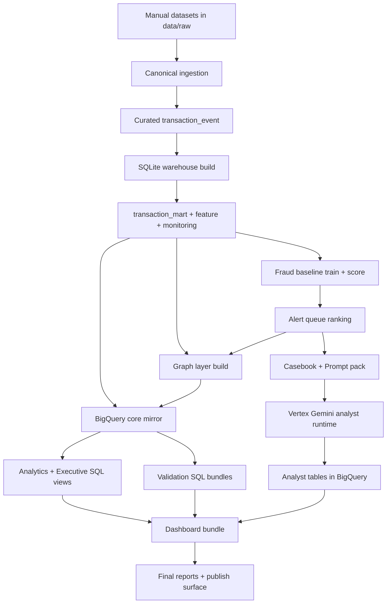

# Fraud - AML Graph Sentinel (TR)

English version (EN): [README.md](README.md)

Dolandiricilik (Fraud) ve kara para aklama ile mucadele (AML) icin uctan uca bir zeka projesi. Su katmanlari tek bir hatta birlestirir:

- cok kaynakli islem verisi ingestion,
- deterministic feature/warehouse modelleme,
- istatistiksel fraud skorlama,
- arastirma kuyrugu onceliklendirme,
- graph/network zeka katmani,
- BigQuery semantik analiz katmani,
- Vertex AI Gemini analist copilot,
- ve yayinlanmaya hazir executive dashboard.

**2026-03-05 UTC** itibariyla tum ana kalite kapilari gecmistir ve proje **READY FOR PUBLISH** durumundadir.

## Icindekiler

- [1. Proje Adi, Konusu, Kapsami](#1-proje-adi-konusu-kapsami)
- [2. Amac, Hedefler ve Beklenen Ciktilar](#2-amac-hedefler-ve-beklenen-ciktilar)
- [3. Yanitlanan Is Sorulari ve Cozulen Problemler](#3-yanitlanan-is-sorulari-ve-cozulen-problemler)
- [4. Uctan Uca Mimari ve Workflow](#4-uctan-uca-mimari-ve-workflow)
- [5. Veri Kaynaklari](#5-veri-kaynaklari)
- [6. Metodoloji (Raw Veriden Karar Katmanina)](#6-metodoloji-raw-veriden-karar-katmanina)
- [7. Agentlar, Modeller ve Islevleri](#7-agentlar-modeller-ve-islevleri)
- [8. Istatistiksel ve Analitik Yontemler](#8-istatistiksel-ve-analitik-yontemler)
- [9. Teknoloji Stack ve Araclar](#9-teknoloji-stack-ve-araclar)
- [10. Repository Yapisi](#10-repository-yapisi)
- [11. Pipeline Asamalari ve Komutlar](#11-pipeline-asamalari-ve-komutlar)
- [12. Validation, Test ve Kalite Kapilari](#12-validation-test-ve-kalite-kapilari)
- [13. Guncel Sonuc Ozeti](#13-guncel-sonuc-ozeti)
- [14. Dashboard Nasil Acilir](#14-dashboard-nasil-acilir)
- [15. Guvenlik, Secret Yonetimi ve Guvenli Open-Source Push](#15-guvenlik-secret-yonetimi-ve-guvenli-open-source-push)
- [16. Tamamlananlar ve Sonraki Gelisim Alanlari](#16-tamamlananlar-ve-sonraki-gelisim-alanlari)

## 1. Proje Adi, Konusu, Kapsami

- **Proje adi:** Fraud - AML Graph Sentinel
- **Konu:** Fraud tespiti + AML izleme + graph tabanli risk zekasi + analist copilot
- **Kapsam:**
  - Heterojen datasetlerden canonical ingestion
  - Yerel, tekrar uretilebilir warehouse (SQLite)
  - Fraud baseline egitim ve skorlama
  - Investigation queue ranking
  - Party/account graph katmani ve supheli cluster tespiti
  - BigQuery mirror ve semantik view katmani
  - Vertex AI Gemini analist ozetleri
  - Executive seviyede statik dashboard ve rapor paketi

## 2. Amac, Hedefler ve Beklenen Ciktilar

### Amac

Portfoy seviyesinde fakat operasyonel gerceklige yakin bir risk analitigi platformu kurmak:

- **operasyonel sorulara** (hangi queue once incelenmeli),
- **yonetsel sorulara** (risk dataset/gun/network bazinda nasil evriliyor)

ayni anda cevap verebilmek.

### Hedefler

- Farkli fraud/AML datasetlerini tek bir canonical semada normalize etmek.
- Deterministic ve tekrar calistirilabilir pipeline yapisi kurmak (artifact-first tasarim).
- Istatistiksel olarak savunulabilir fraud olasiliklari ve queue siralamasi uretmek.
- Kararlari graph/network risk baglami ile zenginlestirmek.
- Yapilandirilmis Gemini analist ciktilarini ayni analitik yuzeye almak.
- Yayin kalitesini acik validation gate'leri ile garanti etmek.

### Beklenen ciktilar

- Local ve cloud katmanlari arasinda satir-seviyesi tutarlilik.
- Validation bundle'larda sifir engelleyici defect.
- Dashboard payload butunlugu ve DOM-binding butunlugu.
- Make target'lari ve run summary artefactlari ile tekrar uretilebilirlik.

## 3. Yanitlanan Is Sorulari ve Cozulen Problemler

Bu proje su yuksek degerli sorulara cevap vermek icin tasarlanmistir:

1. Hangi queue-gun kombinasyonlari analistler tarafindan hemen onceliklendirilmeli?
2. Risk hacmini hangi datasetler surukluyor, scoring coverage datasetler arasinda nasil degisiyor?
3. Fraud ve AML sinyalleri zaman icinde ve kaynak bazinda nasil birlikte gorunuyor?
4. Islem aginda hangi entity/cluster'lar topoloji + risk kaniti ile supheli gorunuyor?
5. Model ciktilari, queue ciktilari ve graph ciktilari kendi icinde tutarli mi?
6. Executive raporlama katmani yayinlamaya yetecek kadar guvenilir mi?
7. Yapilandirilmis analist copilot auditability bozulmadan aksiyon alinabilir ozetler uretebiliyor mu?

## 4. Uctan Uca Mimari ve Workflow



## 5. Veri Kaynaklari

### Mevcut build'de kullanilan zorunlu datasetler

| Dataset ID | Kaynak | Ana Label(lar) | Pipeline'daki rol |
|---|---|---|---|
| `ieee_cis` | Kaggle IEEE-CIS Fraud Detection | `isFraud` | Fraud training/scoring/ranking |
| `creditcard_fraud` | Kaggle ULB Credit Card Fraud | `Class` | Fraud training/scoring/ranking |
| `paysim` | Kaggle PaySim1 | `isFraud` | Fraud training/scoring/ranking |
| `ibm_aml_data` | IBM AML-Data | `Is Laundering` -> `label_aml` | AML ve graph zenginlestirme |

### Opsiyonel faz-2 datasetler (dokumanda hazir)

- `banksim`
- `ibm_amlsim`
- `elliptic`

## 6. Metodoloji (Raw Veriden Karar Katmanina)

### 6.1 Canonical Ingestion

Script: `scripts/ingest_canonical.py`

- Adapter'lar heterojen semalari tek bir `transaction_event` sozlesmesine donusturur.
- Canonical kolonlar: kimlikler, party/account alanlari, kanal/tip, amount/currency, fraud/AML label'lari, governance alanlari ve ingestion metadata.
- Adapter seviyesindeki donusumler event-time, entity ID, kategori ve label standardizasyonu saglar.

### 6.2 Local Warehouse Modelleme

Script: `scripts/build_sqlite_warehouse.py`

Olusturulan tablolar:

- `transaction_event_raw`
- `stg_transaction_event`
- `transaction_mart`
- `feature_payer_24h` (point-in-time safe 24 saatlik payer aktivite feature'lari)
- `feature_graph_24h` (point-in-time safe party/edge interaction feature'lari)
- `monitoring_mart` (gunluk monitoring aggregate'leri)

Tasarim tercihleri:

- deterministic table rebuild,
- sorgu verimliligi icin index olusturma,
- smoke/core/full modlari icin opsiyonel satir limitleri,
- `feature_payer_24h` icin feature base secim modlari:
  - `capped` (global limit),
  - `per_dataset` (dataset bazli dengeli limit),
  - `full` (uygun tum satirlar).

### 6.3 Fraud Baseline Egitim ve Skorlama

Scriptler:

- `scripts/train_fraud_baseline_numpy.py`
- `scripts/score_fraud_baseline_numpy.py`

Modelleme yaklasimi:

- NumPy ile logistic regression implementasyonu
- Mini-batch gradient descent
- Weighted BCE + L2 regularization
- Zaman tabanli split modlari:
  - `global_time`
  - `per_dataset_time` (multi-source fairness icin onerilen)
- Asimetrik is maliyeti ile manuel threshold optimizasyonu

Feature engineering:

- Sayisal: `log_amount`, `payer_txn_count_24h`, `log_payer_amt_sum_24h`,
  `graph_payer_incoming_txn_count_24h`, `graph_payer_unique_payees_24h`,
  `graph_pair_txn_count_30d`, `log_graph_pair_amt_sum_30d`, `graph_reciprocal_pair_txn_count_30d`,
  `hour_of_day`, `day_of_week`
- Kategorik one-hot: `dataset_id`, `channel`, `txn_type`, `currency`

### 6.4 Queue Ranking Katmani

Script: `scripts/build_investigation_queue.py`

- `alert_queue` tablosunu, her `queue_id` (`dataset_id|event_date`) icinde event'leri fraud score'a gore azalan sirada dizerek olusturur.
- Queue-seviyesi ranking metriklerini hesaplar (`Precision@K`, `NDCG@K`).

### 6.5 Graph Intelligence Katmani

Script: `scripts/build_graph_layer.py`

Olusturulan tablolar:

- `graph_party_node`
- `graph_party_edge`
- `graph_account_node`
- `graph_account_edge`
- `graph_party_cluster_membership`
- `graph_party_cluster_summary`

Yontem:

- Event enrichment asamasi transaction + score + queue baglamini birlestirir.
- Edge/node risk skorlarinda agirlikli kanit harmanlama kullanilir.
- Supheli party component'leri union-find clustering ile cikartilir.

### 6.6 Cloud Analytics Katmani (BigQuery)

Scriptler:

- `scripts/sqlite_to_bigquery.py`
- `scripts/run_bigquery_sql_bundle.py`
- `scripts/validate_bigquery_state.py`

Ne olur:

- Local core/graph tablolari BigQuery'de `dev_*` tablolara yuklenir.
- SQL bundle'lari analytics view'lari ve validation ciktilarini olusturur.
- State ve kalite kontrolleri satir esiklerini ve veri dogrulugunu zorlar.

### 6.7 Analyst Copilot Katmani (Vertex AI Gemini)

Scriptler:

- `scripts/build_analyst_casebook.py`
- `scripts/build_analyst_prompt_pack.py`
- `scripts/run_vertex_analyst_copilot.py`
- `scripts/validate_vertex_analyst_outputs.py`
- `scripts/vertex_outputs_to_bigquery.py`

Yaklasim:

- Queue + graph kanitindan deterministic case packet uretilir.
- Provider-agnostic prompt pack olusturulur.
- Structured JSON response contract uygulanir.
- Schema validation ve deterministic fallback path calisir.
- Dogrulanan ciktilar BigQuery'ye yuklenir ve analyst view'lara yansir.

### 6.8 Dashboard ve Raporlama Katmani

Scriptler:

- `scripts/build_dashboard_bundle.py`
- `scripts/validate_dashboard_bundle.py`
- `scripts/generate_checkpoint_reports.py`
- `scripts/generate_project_briefing_report.py`
- `scripts/generate_master_final_report.py`
- `scripts/generate_master_final_report_en.py`

Uretilen ciktilar:

- statik dashboard bundle (`dashboard/`)
- checkpoint, briefing ve final raporlar (Markdown/TXT/PDF/JSON snapshot)

## 7. Agentlar, Modeller ve Islevleri

### 7.1 Pipeline icindeki agent-benzeri bilesenler

| Bilesen | Islev | Girdi | Cikti |
|---|---|---|---|
| Analyst Casebook Builder | Ust queue'lari queue/party/cluster kaniti ile inceleme vakalarina paketler | `alert_queue`, graph tablolari | `artifacts/agent/casebook/*/casebook.json` |
| Prompt Pack Builder | Case paketlerini strict contract ile model-girdi formatina cevirir | casebook | `artifacts/agent/prompt_pack/*/*.json` |
| Vertex Analyst Runtime | Gemini modellerini cagirir, structured case ciktilari uretir | prompt pack | `artifacts/agent/vertex_responses/*` |
| Vertex Output Validator | Schema/tutarlilik/hata kisitlarini uygular | Vertex output klasoru | pass/fail raporu |
| Vertex-to-BigQuery Loader | Dogrulanan analist ciktilarini cloud tabloya yukler | validated outputs | `dev_analyst_case_summary` |

### 7.2 Kullanilan modeller

| Model Katmani | Model | Amac |
|---|---|---|
| Fraud baseline | NumPy logistic regression | Islem seviyesinde fraud risk skoru |
| Fraud benchmark | NumPy logistic + interaction feature + Platt calibration | Baseline'a gore lift ve olasilik kalibrasyon karsilastirmasi |
| Fraud tree benchmark (opsiyonel) | `HistGradientBoostingClassifier` + Platt calibration | Non-linear benchmark ve queue seviyesinde karsilastirma |
| Analyst copilot default | Vertex AI uzerinde `gemini-2.5-flash` | Hizli structured analist ozetleri |
| Analyst copilot escalation | Vertex AI uzerinde `gemini-2.5-pro` | Belirsiz/yuksek etkili vakalarda escalation |

## 8. Istatistiksel ve Analitik Yontemler

### Fraud skorlama metrikleri

- Average Precision (AP)
- PR-AUC (trapezoid integration)
- Cost-optimized decision threshold (`FP cost = 1`, `FN cost = 25`)

### Ranking metrikleri

- Precision@K (varsayilan K=50)
- NDCG@K

### Graph analitigi

- Sinirlandirilmis agirlikli formul ile node/edge risk skor birlestirme
- Supheli edge baglantilari uzerinden cluster cikarma

### Kalite metrikleri

- Null/duplicate key kontrolleri
- Score/rank aralik gecerliligi kontrolleri
- Fraud/AML label domain kontrolleri
- Party/account namespace collision kontrolleri
- Executive/analyst view contract kontrolleri

## 9. Teknoloji Stack ve Araclar

### Cloud ve platform

- Google Cloud Project: `fraud-aml-graph`
- BigQuery dataset: `fraud_aml_graph_dev`
- Vertex AI region: `europe-west4`
- Cloud Storage bucket (runtime artifact): `fraud-aml-graph-vertex-ew4`

### Diller

- Python
- SQL (BigQuery Standard SQL)
- JavaScript
- HTML/CSS
- Make (automation orchestration)

### Kod tabaninda kullanilan Python/runtime paketleri

Ana ucuncu parti paketler:

- `numpy`
- `pandas`
- `matplotlib`
- `google-cloud-bigquery`
- `google-auth`
- `google-genai`

Kod taramasindan paket envanteri (pipeline snapshot):

- `argparse`, `ast`, `base64`, `csv`, `dataclasses`, `datetime`, `google`, `json`, `matplotlib`, `numpy`, `os`, `pandas`, `pathlib`, `re`, `shutil`, `sqlite3`, `textwrap`, `time`, `typing`, `zlib`

### Local onkosullar

- Python 3.11+
- GNU Make
- BigQuery aktif GCP proje (cloud asamalar icin)
- Secilen region'da Vertex AI aktif (copilot asamalari icin)

Ana Python bagimliliklarini kurulum:

```bash
python3 -m pip install --upgrade pip
python3 -m pip install -r requirements.txt
```

Muhendislik arac zinciri (test/lint/security/XAI):

```bash
python3 -m pip install -r requirements-dev.txt
```

Cloud script'lerinin bekledigi environment variable'lar:

```bash
export GCP_PROJECT_ID="fraud-aml-graph"
export BQ_DATASET="fraud_aml_graph_dev"
export BQ_LOCATION="EU"
export GOOGLE_APPLICATION_CREDENTIALS="/absolute/path/to/your/service-account.json"
```

## 10. Repository Yapisi

```text
Fraud - AML Graph/
├── Makefile
├── README.md
├── README.tr.md
├── requirements.txt
├── requirements-dev.txt
├── requirements.lock
├── pyproject.toml
├── dashboard/
│   ├── index.html
│   ├── app.js
│   ├── styles.css
│   ├── dashboard-data.json
│   └── dashboard-data.js
├── data/
│   ├── raw/          # manuel dataset yerlestirme (gitignored)
│   ├── curated/      # canonical ciktilar (gitignored)
│   └── warehouse/    # SQLite DB + ozetler (gitignored)
├── scripts/
│   ├── ingest_canonical.py
│   ├── build_sqlite_warehouse.py
│   ├── train_fraud_baseline_numpy.py
│   ├── score_fraud_baseline_numpy.py
│   ├── build_investigation_queue.py
│   ├── build_graph_layer.py
│   ├── sqlite_to_bigquery.py
│   ├── run_bigquery_sql_bundle.py
│   ├── build_analyst_casebook.py
│   ├── build_analyst_prompt_pack.py
│   ├── run_vertex_analyst_copilot.py
│   ├── validate_*.py
│   └── generate_*_report.py
├── sql/
│   ├── staging/
│   ├── marts/
│   ├── features/
│   └── bigquery/
│       ├── analytics/
│       ├── graph_analytics/
│       ├── executive_views/
│       ├── executive_validation/
│       ├── analyst_views/
│       ├── analyst_validation/
│       └── validation/
├── docs/
├── schemas/
│   └── transaction_event.schema.json
├── tests/
├── reports/
└── artifacts/        # run summary, model ciktilari, rapor kanitlari
```

## 11. Pipeline Asamalari ve Komutlar

### 11.1 Local core pipeline

```bash
make check-datasets
make validate-schema
make ingest-core
make warehouse-core
make train-fraud
python3 scripts/score_fraud_baseline_numpy.py --model-path artifacts/models/fraud_baseline/latest/model.npz
python3 scripts/build_investigation_queue.py --top-k 50
make validate-state
```

### 11.2 Graph katmani

```bash
make graph-build
make graph-validate
```

### 11.3 BigQuery mirror + semantik view'lar

```bash
make sqlite-to-bq-full
make sqlite-graph-to-bq
make bq-create-analytics
make bq-create-graph-analytics
make bq-create-executive-views
make bq-validate-executive-views
make bq-validate-state
make bq-validate-graph-state
```

### 11.4 Analyst copilot pipeline

```bash
make agent-casebook-validate
make agent-prompt-pack-validate
make agent-vertex-batch-validate
make agent-prompt-eval
make vertex-to-bq
make bq-analyst-check
```

### 11.5 Dashboard + final raporlama

```bash
make dashboard-check
make report-master
make report-master-en
```

### 11.6 Benchmark model ve karsilastirma

```bash
make model-benchmark-pipeline
```

Ciktilar:

- benchmark model artefactlari: `artifacts/models/fraud_benchmark_numpy/latest/`
- benchmark score tablosu: `fraud_scores_benchmark`
- benchmark ranking ozeti: `artifacts/models/ranking_benchmark/latest/ranking-summary.json`
- model karsilastirma raporu: `reports/08_Model_Benchmark_Comparison_EN.md`

Opsiyonel tree benchmark:

```bash
make tree-benchmark-pipeline
make tree-shap
```

Muhendislik kalite paketi:

```bash
make quality-local
```

### 11.7 Reproducible Sample Smoke Pipeline

```bash
make sample-e2e
```

Ne yapar:

- `data/sample/transaction_event` altinda deterministic synthetic canonical dataset uretir
- sample SQLite warehouse kurar (`data/sample/warehouse/ledger_sentinel_sample.db`)
- sample DB uzerinde baseline modeli egitir/score eder
- queue ve graph katmanlarini olusturur
- sample DB uzerinde pipeline ve graph validation gate'lerini calistirir

## 12. Validation, Test ve Kalite Kapilari

Validation yaklasimi explicit ve script-driven'dir; implicit degildir.

### Core local gate'ler

- `validate_pipeline_state.py`
  - canonical manifest ve satir sayisi kontrolleri
  - zorunlu tablolarin varligi ve bos olmama kontrolleri
  - fraud score dagilim kontrolleri
  - queue ayrismasi/tutarlilik kontrolleri
  - kritik veri kalitesi null/domain/collision kontrolleri
  - `feature_payer_24h` ve `feature_graph_24h` coverage threshold kontrolleri

### Graph gate'leri

- `validate_graph_state.py`
  - zorunlu graph tablolari
  - bos olmama kontrolleri
  - risk score aralik kontrolleri
  - duplicate ID kontrolleri
  - party/account namespace collision kontrolleri
  - cluster membership-summary tutarlilik kontrolleri

### BigQuery gate'leri

- `validate_bigquery_state.py`
  - core ve graph `dev_*` tablolarinda minimum satir threshold kontrolleri
  - ana kalite kontrolleri (null ID, score araligi, rank gecerliligi)
  - opsiyonel graph tutarlilik kontrolleri

### Dashboard gate'leri

- `validate_dashboard_bundle.py`
  - payload sema ve aggregate tutarlilik kontrolleri
  - dataset lens ve score-bucket tutarlilik kontrolleri
  - analyst panel butunlugu
  - quality panel muhasebe tutarliligi
  - evidence artifact varlik kontrolleri
  - HTML/JS binding tutarliligi ve CSS design token kontrolleri
  - drift panel sozlesmesi (`PSI`, `KS`, queue stability Jaccard)

### Agent output gate'leri

- `validate_vertex_analyst_outputs.py`
  - response sayisi ve dataset cesitliligi kontrolleri
  - runtime ve schema hata kontrolleri
  - zorunlu structured alanlar ve dosya-seviyesi kanit kontrolleri
  - prompt contract kontrolleri (versioned payload policy + masking)

### CI smoke kontrolleri

- GitHub Actions workflow: `.github/workflows/smoke-sample.yml`
- Her push ve pull request'te `make sample-e2e` calistirarak reproducibility regression kontrolu yapar.

### CI quality gate'leri

- GitHub Actions workflow: `.github/workflows/quality-gates.yml`
- Su adimlari calistirir:
  - `ruff check scripts tests`
  - `black --check scripts tests`
  - `pytest`
  - `python -m compileall scripts`
  - `pip-audit -r requirements.txt` (bilgilendirici, non-blocking)

## 13. Guncel Sonuc Ozeti

Kaynak: guncel checkpoint ve model-comparison snapshot'lari.

### Pipeline olcegi

- `transaction_mart`: **1,184,807** satir
- `fraud_scores`: **884,807** satir
- Farkli gunluk queue sayisi: **88**
- Graph party node: **582,652**
- Graph party edge: **462,948**

### Model ve ranking

- Baseline AP / PR-AUC: **0.0710 / 0.0708**
- Baseline Mean Precision@50 / NDCG@50: **6.91% / 6.96%**
- Benchmark AP / PR-AUC: **0.0725 / 0.0725**
- Benchmark Mean Precision@50 / NDCG@50: **8.73% / 8.20%**
- Tree benchmark AP / PR-AUC: **0.1385 / 0.1378**
- Tree benchmark Mean Precision@50 / NDCG@50: **27.07% / 29.83%**

### Kalite durumu

- Dashboard check: **13/13 passed**
- Dashboard defect: **0**
- BigQuery state gate: **PASS**
- Vertex analyst error count: **0**
- Final readiness: **READY FOR PUBLISH**

## 14. Dashboard Nasil Acilir

Local build ve servis:

```bash
cd "Fraud - AML Graph"
make dashboard-build
python3 -m http.server 8080
```

Acilis adresi:

- `http://localhost:8080/dashboard/`

## 15. Guvenlik, Secret Yonetimi ve Guvenli Open-Source Push

### Secret handling politikasi

- Service-account JSON anahtarlari sadece local tutulur ve gitignore'dadir.
- `.secrets/`, `api keys/`, `.env*` varsayilan olarak ignore edilir.
- Ek key-benzeri uzantilar ignore edilir (`*.pem`, `*.p12`, `*.pfx`, `*.key`, `*service-account*.json`, `*credentials*.json`).

### Push oncesi kontrol

- `git status` icinde key dosyasi olmadigini dogrula.
- Kimlik bilgilerini sadece local ignore edilen path'lerde tut.
- Gecmiste herhangi bir key sizdiysa repo'yu public yapmadan once rotate/revoke et.

## 16. Tamamlananlar ve Sonraki Gelisim Alanlari

### Tamamlananlar

- Fraud+AML icin tam bir data-to-decision pipeline kuruldu.
- Graph intelligence ve queue-level onceliklendirme eklendi.
- Leakage-safe graph interaction feature'lari fraud model train/score hattina entegre edildi.
- `label_type` sozlesmesi (`fraud` / `aml` / `unknown`) ve subtask metrik yolu eklendi.
- `feature_asof_ts` kolonlari ve as-of leakage validator kontrolleri eklendi.
- Gemini tabanli analyst copilot, validation ve BigQuery entegrasyonuyla calisir hale getirildi.
- Analyst prompt governance (`prompt_version`, payload policy version, allowlist+masking) eklendi.
- Analyst runtime izlenebilirligi icin JSONL audit log (`audit-log.jsonl`) eklendi.
- Drift izleme paneli (`PSI`, bucketed `KS`, top-20 queue Jaccard) eklendi.
- Tree benchmark icin opsiyonel SHAP explainability hattı eklendi (`make tree-shap`).
- Guclu kalite kapilari ve publish kriterleri tanimlandi.
- Profesyonel dashboard ve TR/EN rapor ciktilari uretildi.

### Publish workflow'lari

- Dashboard Pages workflow: `.github/workflows/pages-dashboard.yml`
- `main` push sonrasinda statik `dashboard/` bundle'ini GitHub Pages'e deploy eder.

### Yuksek etki potansiyelli sonraki adimlar

1. Mevcut leakage-safe graph interaction'larin uzerine daha zengin supervised graph feature'lari (ornegin centrality/community embedding) eklemek.
2. Dataset bazinda calibration katmanini daha da derinlestirmek (drift paneli eklendi, advanced thresholds genisletilebilir).
3. CI pipeline'i (lint + smoke + validator suite) branch politikalarina gore zorunlu hale getirmek.
4. Senaryo simulasyonu ve what-if queue stress test katmani eklemek.
5. Analist aksiyonlarini retraining dongusune geri besleyen human-in-the-loop mekanizmasi eklemek.

---

## Bu Repository'deki Ana Teslimatlar

- Final EN raporu: `reports/07_Master_Final_Report_EN.pdf`
- Final TR raporu: `reports/07_Master_Final_Rapor_TR.pdf`
- Dashboard bundle: `dashboard/`
- Master automation giris noktasi: `Makefile`
