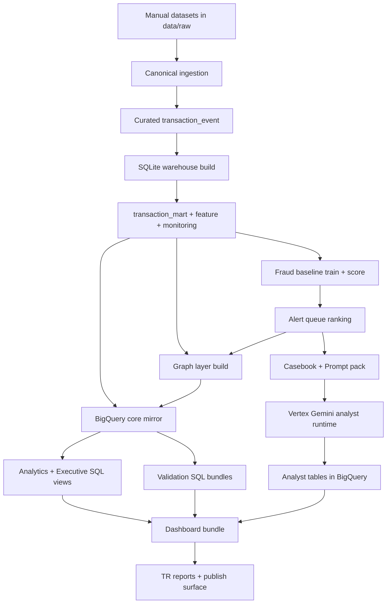

# Fraud - AML Graph Sentinel | Master Final Raporu (TR)

Uretim tarihi (UTC): 2026-03-04T20:58:23Z

## 1. Yonetici Ozeti
- Publish readiness: **READY FOR PUBLISH**
- Dashboard quality gate: `True`
- BigQuery state gate: `True`
- Vertex analyst gate: `error_count=0`
- Executive invalid checks zero: `True`
- Analyst defect checks zero: `True`

## 2. Proje Kimligi ve Kapsam
- Proje adi: Fraud - AML Graph Sentinel
- Proje kimligi: fraud-aml-graph
- BigQuery dataset: fraud_aml_graph_dev (EU)
- Konu: Fraud tespiti + AML izleme + graph intelligence + investigation queue + executive analytics
- Kapsam: Canonical ingestion, local warehouse, baseline model, ranking, graph layer, BigQuery mirror, dashboard, analyst copilot
- Theme: Mineral Ledger

## 3. Is Problemi ve Yanitlanan Sorular
- Hangi queue gunleri investigasyon onceligine alinmali?
- Hangi datasetlerde risk baskisi yuksek ve neden?
- Fraud ve AML sinyalleri ayni operational yuzeyde nasil birlikte izlenir?
- Graph tarafinda hangi party/cluster yapilari supheli?
- Local state ile BigQuery state birebir uyumlu mu?
- Publish edilen dashboard sayilari validator kapilarindan geciyor mu?

## 4. Uctan Uca Mimari ve Workflow

## 5. Metodoloji
- Canonical schema normalization
- SQLite warehouse with deterministic rebuild
- Point-in-time feature engineering
- Baseline fraud scoring (numpy/pandas pipeline)
- Queue ranking with P@K / NDCG@K
- Graph node-edge aggregation + cluster summaries
- BigQuery mirror + SQL analytics + SQL validation
- Artifact-first reporting and static dashboard bundling
- Vertex Gemini analyst outputs with schema validation and deterministic fallback

## 6. Toolchain (Kod Tabanindan Taranmis)
### 6.1 Genel Paketler
- argparse
- ast
- base64
- csv
- dataclasses
- datetime
- google
- json
- matplotlib
- numpy
- os
- pandas
- pathlib
- re
- shutil
- sqlite3
- textwrap
- time
- typing
- zlib

### 6.2 Script Bazli Import Haritasi
- bigquery_test_connection.py: google, os, pathlib
- build_analyst_casebook.py: argparse, datetime, json, pathlib, sqlite3, typing
- build_analyst_prompt_pack.py: argparse, datetime, json, pathlib, typing
- build_dashboard_bundle.py: datetime, json, pathlib, sqlite3, typing
- build_graph_layer.py: argparse, datetime, json, pathlib, sqlite3, typing
- build_investigation_queue.py: argparse, datetime, json, numpy, pandas, pathlib, sqlite3, typing
- build_sqlite_warehouse.py: argparse, datetime, json, pandas, pathlib, sqlite3, typing
- cleanup_incomplete_runs.py: argparse, dataclasses, json, pathlib, shutil, typing
- extract_pdf_text.py: argparse, base64, dataclasses, pathlib, re, typing, zlib
- generate_checkpoint_reports.py: datetime, json, matplotlib, os, pathlib, textwrap, typing
- generate_master_final_report.py: ast, csv, datetime, json, matplotlib, os, pathlib, textwrap, typing
- generate_master_final_report_en.py: datetime, json, matplotlib, os, pathlib, textwrap, typing
- generate_project_briefing_report.py: ast, datetime, json, matplotlib, os, pathlib, textwrap, typing
- ingest_canonical.py: argparse, dataclasses, datetime, json, numpy, pandas, pathlib, re, typing
- run_bigquery_sql_bundle.py: argparse, csv, datetime, google, json, os, pathlib, typing
- run_vertex_analyst_copilot.py: argparse, datetime, google, json, os, pathlib, time, typing
- score_fraud_baseline_numpy.py: argparse, datetime, json, numpy, pandas, pathlib, sqlite3, typing
- sqlite_to_bigquery.py: argparse, datetime, google, json, numpy, os, pandas, pathlib, sqlite3, typing
- train_fraud_baseline_numpy.py: argparse, csv, dataclasses, datetime, json, numpy, pandas, pathlib, shutil, sqlite3, typing
- validate_analyst_casebook.py: argparse, json, pathlib, typing
- validate_analyst_prompt_pack.py: argparse, json, pathlib, typing
- validate_analyst_sql_bundle.py: datetime, json, pathlib, re, typing
- validate_bigquery_state.py: argparse, datetime, google, json, os, pathlib, typing
- validate_dashboard_bundle.py: datetime, json, pathlib, re, typing
- validate_executive_sql_bundle.py: datetime, json, pathlib, re, typing
- validate_graph_state.py: argparse, json, pathlib, sqlite3, typing
- validate_pipeline_state.py: argparse, json, pathlib, sqlite3, typing
- validate_vertex_analyst_outputs.py: argparse, json, pathlib, typing
- vertex_outputs_to_bigquery.py: argparse, datetime, google, json, os, pathlib, typing

## 7. Veri Envanteri ve Aktif Hacimler
- transaction_event_raw: 1,184,807
- stg_transaction_event: 1,184,807
- transaction_mart: 1,184,807
- feature_payer_24h: 150,000
- monitoring_mart: 90
- fraud_scores total: 884,807
- alert queue count (distinct daily queues): 88
- scored rows by dataset: creditcard=284,807, ieee=300,000, paysim=300,000

## 8. Model ve Ranking Sonuclari
- average_precision: 0.0424
- pr_auc_trapz: 0.0424
- cost_optimized_threshold: 0.624862
- queue_count: 88
- mean_precision_at_k: 7.45%
- mean_ndcg_at_k: 7.11%
- queues_with_positive_labels: 88

## 9. Graph Katmani
- graph_party_node: 582,652
- graph_party_edge: 462,948
- graph_account_node: 582,652
- graph_account_edge: 462,948
- graph_party_cluster_membership: 445,060
- graph_party_cluster_summary: 134,702

## 10. BigQuery Katmani (Canli Validasyon)
- state ok: `True`
- dev_transaction_mart: 1,184,807
- dev_fraud_scores: 884,807
- dev_alert_queue: 884,807
- dev_graph_party_node: 582,652
- dev_graph_party_edge: 462,948

### 10.1 Executive View Kontrolleri
- dev_exec_dataset_surface: 4
- dev_exec_queue_watchlist: 88
- dev_exec_overview_kpi: 1
- dev_exec_daily_surface: 180
- dev_exec_graph_watchlists: 717,354
- overview_single_row: 1
- dataset_surface_unique_datasets: 4
- daily_surface_overview_rows: 90
- queue_watchlist_nonzero_rows: 88
- graph_watchlists_nonzero_rows: 717354
- invalid_overview_scoring_coverage: 0
- invalid_dataset_share_of_volume: 0
- invalid_daily_top50_precision: 0
- invalid_queue_rank: 0
- invalid_graph_watchlist_rank: 0

### 10.2 Analyst View Kontrolleri
- dev_exec_analyst_action_items: 12
- dev_analyst_case_summary: 3
- dev_exec_analyst_surface: 3
- empty_recommended_actions: 0
- missing_queue_join_metrics: 0
- invalid_action_rank: 0
- invalid_risk_values: 0
- missing_case_overview: 0
- invalid_overall_priority: 0

## 11. Vertex Gemini Analyst Katmani
- run_id: 20260304T202949Z
- location: europe-west4
- model: gemini-2.5-flash
- fallback_model: gemini-2.5-pro
- response_count: 3
- error_count: 0
- deterministic_fallback_count: 2
- promoted_to_latest: True

## 12. Dashboard Publish Katmani
- dashboard validator ok: `True`
- dataset_count: 4
- total_transactions: 1,184,807
- total_scored_rows: 884,807
- passed_checks/total_checks: 13/13
- total_defects: 0
- html_id_count/js_bound_id_count: 32/32

## 13. Riskler ve Dikkat Noktalari
- No-score datasetler icin score bucket ve queue fallback uretimi yapilmamali (yanlis yorum riski).
- Graph namespace ayrimi korunmali (party/account collision riski).
- BigQuery live checkler periyodik tekrar edilmeli; artifact timestamp izlenmeli.
- Vertex quota/response truncation durumlari icin deterministic fallback katmani aktif tutulmali.
- Publish oncesi dashboard validator kapisi bypass edilmemeli.

## 14. Test Komutlari (Tekrar Edilebilirlik)
- make validate-state
- make graph-validate
- make dashboard-check
- make agent-vertex-batch-validate
- make bq-full-check
- make bq-graph-check
- make bq-validate-executive-views
- make bq-analyst-check

## 15. Kanit Artefaktlari
- reports/03_Operational_Checkpoint_Snapshot.json
- artifacts/dashboard/validate-dashboard-state.json
- artifacts/agent/vertex_responses/latest/run-summary.json
- artifacts/bigquery/sql-runs/20260304T203401Z/run-summary.json
- artifacts/bigquery/sql-runs/20260304T203520Z/run-summary.json
- artifacts/bigquery/sql-runs/20260304T203529Z/run-summary.json

## 16. Nihai Karar
- Publish readiness: **READY FOR PUBLISH**
- Kapsam dahilinde bloklayan acik bug bulunmadi.
