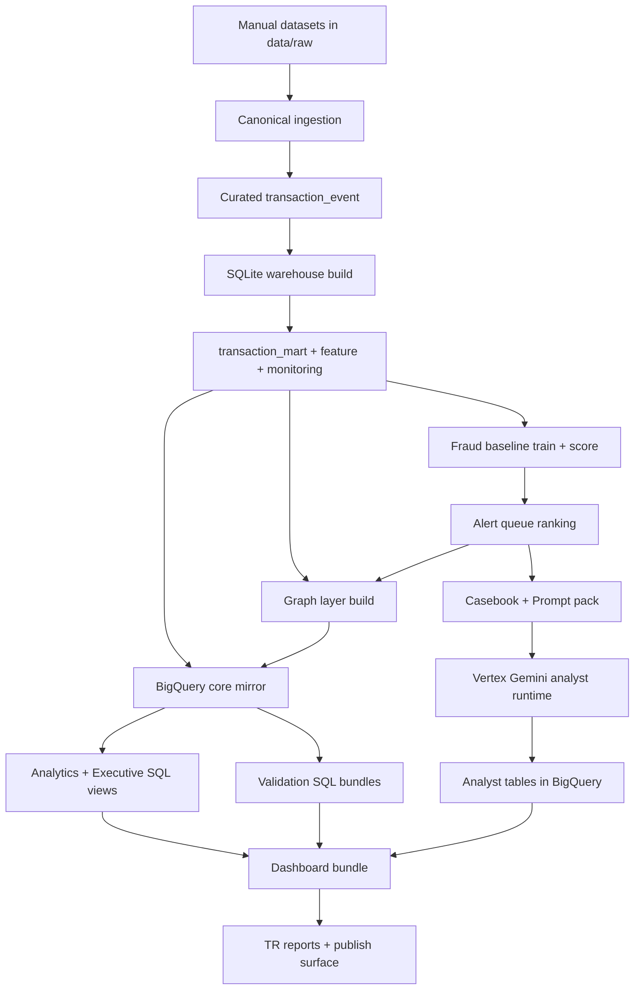

# Fraud - AML Graph Sentinel | Master Final Report (EN)

Generated at (UTC): 2026-03-04T20:58:23Z

## 1. Executive Summary
- Publish readiness: **READY FOR PUBLISH**
- Dashboard quality gate: `True`
- BigQuery state gate: `True`
- Vertex analyst gate: `error_count=0`
- Executive invalid checks zero: `True`
- Analyst defect checks zero: `True`

## 2. Project Identity and Scope
- Project name: Fraud - AML Graph Sentinel
- Project id: fraud-aml-graph
- BigQuery dataset: fraud_aml_graph_dev (EU)
- Scope: Canonical ingestion, local warehouse, baseline model, ranking, graph layer, BigQuery mirror, dashboard, analyst copilot

## 3. End-to-End Workflow (Mermaid)

## 4. Data Inventory and Active Volumes
- transaction_event_raw: 1,184,807
- stg_transaction_event: 1,184,807
- transaction_mart: 1,184,807
- feature_payer_24h: 150,000
- monitoring_mart: 90
- fraud_scores total: 884,807
- distinct alert queues: 88
- scored rows by dataset: creditcard=284,807, ieee=300,000, paysim=300,000

## 5. Model and Ranking Metrics
- average_precision: 0.0424
- pr_auc_trapz: 0.0424
- cost_optimized_threshold: 0.624862
- mean_precision_at_k: 7.45%
- mean_ndcg_at_k: 7.11%
- queues_with_positive_labels: 88

## 6. Graph Layer
- graph_party_node: 582,652
- graph_party_edge: 462,948
- graph_account_node: 582,652
- graph_account_edge: 462,948
- graph_party_cluster_membership: 445,060
- graph_party_cluster_summary: 134,702

## 7. BigQuery Live Validation
- state ok: `True`
- dev_transaction_mart: 1,184,807
- dev_fraud_scores: 884,807
- dev_alert_queue: 884,807
- dev_graph_party_node: 582,652
- dev_graph_party_edge: 462,948

### 7.1 Executive View Checks
- dev_exec_dataset_surface: 4
- dev_exec_queue_watchlist: 88
- dev_exec_overview_kpi: 1
- dev_exec_daily_surface: 180
- dev_exec_graph_watchlists: 717,354
- overview_single_row: 1
- dataset_surface_unique_datasets: 4
- daily_surface_overview_rows: 90
- queue_watchlist_nonzero_rows: 88
- graph_watchlists_nonzero_rows: 717354
- invalid_overview_scoring_coverage: 0
- invalid_dataset_share_of_volume: 0
- invalid_daily_top50_precision: 0
- invalid_queue_rank: 0
- invalid_graph_watchlist_rank: 0

### 7.2 Analyst View Checks
- dev_exec_analyst_action_items: 12
- dev_analyst_case_summary: 3
- dev_exec_analyst_surface: 3
- empty_recommended_actions: 0
- missing_queue_join_metrics: 0
- invalid_action_rank: 0
- invalid_risk_values: 0
- missing_case_overview: 0
- invalid_overall_priority: 0

## 8. Vertex Gemini Analyst Layer
- run_id: 20260304T202949Z
- location: europe-west4
- model: gemini-2.5-flash
- fallback_model: gemini-2.5-pro
- response_count: 3
- error_count: 0
- deterministic_fallback_count: 2
- promoted_to_latest: True

## 9. Dashboard Publish Layer
- dashboard validator ok: `True`
- total_transactions: 1,184,807
- total_scored_rows: 884,807
- passed_checks/total_checks: 13/13
- total_defects: 0

## 10. Risks and Guardrails
- Keep no-score datasets out of score-bucket/queue logic.
- Preserve party/account namespace isolation in graph IDs.
- Keep dashboard validator as a hard publish gate.
- Keep deterministic fallback active for quota/truncation edge cases.

## 11. Final Decision
- Publish readiness: **READY FOR PUBLISH**
- No blocking defects found within current scope.
